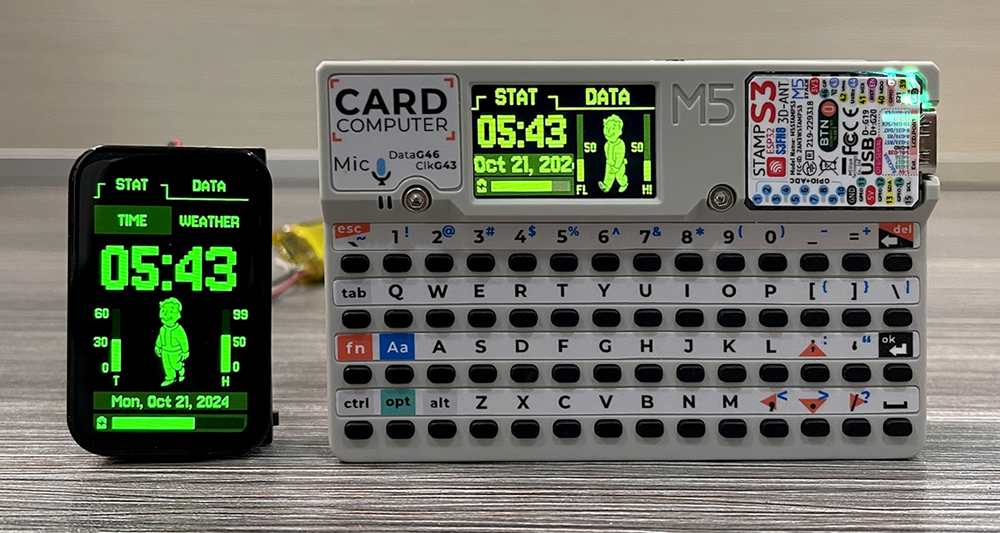

# Pip Boy Weather Clock Using LVGL

---
<p align="center">
  <span style="color: yellow;">If you like this project, consider supporting it:</span>
</p>

<p align="center">
  <a href="https://www.buymeacoffee.com/nishad2m8" target="_blank">
    
  </a>
  <a href="https://www.youtube.com/channel/UCV_35rUyf4N5mHZXaxaFKiQ" target="_blank">
    
  </a>
</p>

---



Check video on 

Lilygo 1.64" : https://youtu.be/y4AK9kuxWG8

Cardputer : https://youtu.be/WOr_QTMYXRI

---
Update the `config.h` file your data
```c++
#ifndef CONFIG_H
#define CONFIG_H

// WiFi credentials (replace with your SSID and password)
#define WIFI_SSID "SSID"
#define WIFI_PASSWORD "PASSWORD"

#define TIME_ZONE "AST-3"  // Adjust this to the desired time zone string

// weatherapi.com API key
#define API_KEY "PPI_KEY"
// Location for weather query
#define LOCATION "LOCATION"


#endif // CONFIG_H
```